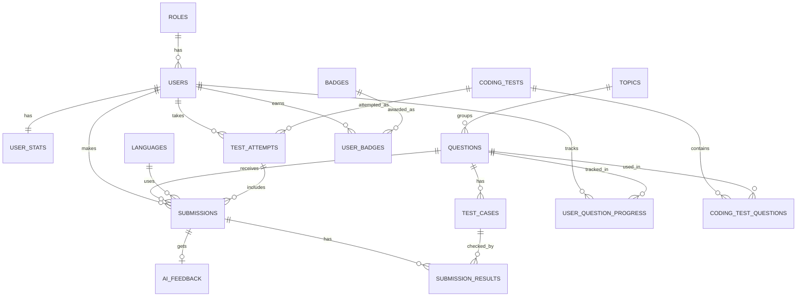

# CodeForge Database Design (ER Diagram)

## How to read the notation

- `||--o{` means "one to many". For example, one topic has many questions.
- `||--||` means "one to one". Each user has exactly one `user_stats` row.
- `||--o|` means "one to zero-or-one". A submission may or may not have AI feedback.